<h2>TensorFlow-FlexUNet-Image-Segmentation-Kidney-Disease-T2W (2026/02/06)</h2>
Sarah T.  Arai 
Software Laboratory antillia.com  
This is the first experiment of Image Segmentation for <b>Kidney-Disease-T2W</b> based on our <a href="./src/TensorFlowFlexUNet.py">TensorFlowFlexUNet</a> 
(TensorFlow Flexible UNet Image Segmentation Model for Multiclass), 
and 
<a href="https://drive.google.com/file/d/1XmiQBApElxumRDO75F-i1CLwh7o-4iW2/view?usp=sharing">
<b>Augmented-Kidney-Disease-T2W-ImageMask-Dataset.zip</b></a> with colorized masks, which was derived by us from   
<a href="https://www.kaggle.com/datasets/orvile/t2-weighted-kidney-mri-segmentation">
<b>T2-weighted Kidney MRI Segmentation</b> </a> on the kaggle.com.
  
<b>Data Augmentation Strategy</b> 
To address the limited size of images and masks of the original <b>T2-weighted Kidney MRI</b> dataset,
we used our offline augmentation tool <a href="./generator/ImageMaskDatasetGenerator.py">ImageMaskDatasetGenerator.py</a> (please see also: 
<a href="https://github.com/sarah-antillia/Image-Deformation-Tool">Image-Deformation-Tool</a>)
 to generate our Augmented Kidney-Disease-T2W dataset.
   

<b>Actual Image Segmentation for Kidney-Disease-T2W Images of 512x512 pixels </b> 
As shown below, the inferred masks predicted by our segmentation model trained by the dataset appear similar to the ground truth masks.
 
<b>rgb_map = {Cronic_Kidney_Disease: red,  Healthy_Control: green}</b>
  
<table>
<tr>
<th>Input: image</th>
<th>Mask (ground_truth)</th>
<th>Prediction: inferred_mask</th>
</tr>
<tr>
<td>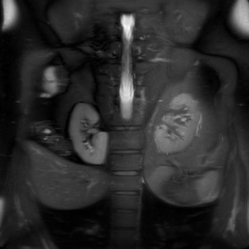</td>
<td>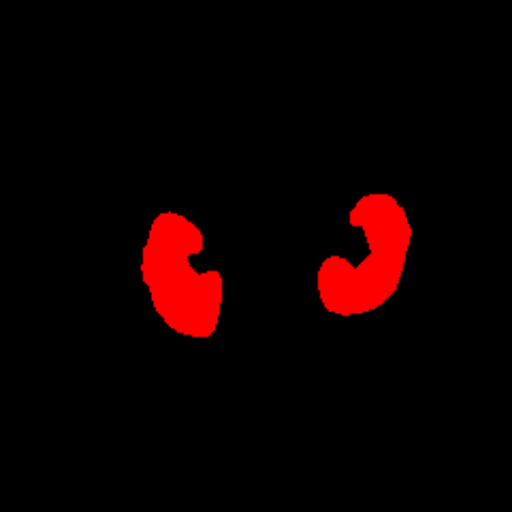</td>
<td>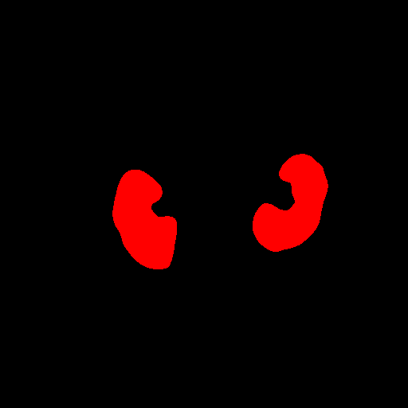</td>
</tr>

<tr>
<td>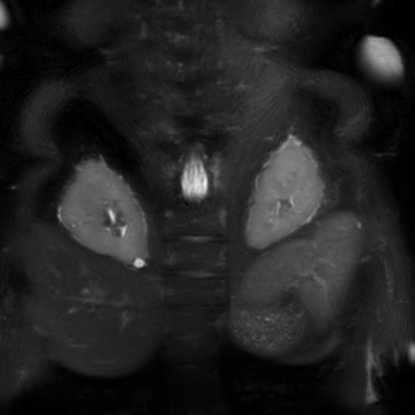</td>
<td>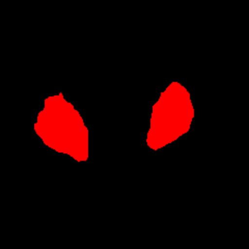</td>
<td></td>
</tr>

<tr>
<td>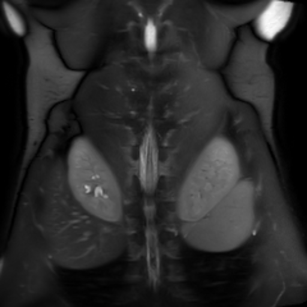</td>
<td></td>
<td></td>
</tr>
</table>

 
<h3>1  Dataset Citation</h3>
The dataset used here was derived from   
<a href="https://www.kaggle.com/datasets/orvile/t2-weighted-kidney-mri-segmentation">
<b>T2-weighted Kidney MRI Segmentation</b> </a>.  
<b>A High-Quality Dataset for Kidney Segmentation in MRI</b>
  
For more information, please refer to <a href="https://onlinelibrary.wiley.com/doi/10.1002/mrm.28768">
Automated renal segmentation in healthy and chronic kidney disease subjects using a convolutional neural network
</a>  

The following explanation was taken from <a href="https://www.kaggle.com/datasets/orvile/t2-weighted-kidney-mri-segmentation">
<b>T2-weighted Kidney MRI Segmentation</b></a>  

<b>About Dataset</b> 
<b>Overview</b> 
This dataset contains 100 T2-weighted abdominal MRI scans with manually segmented kidney masks.  
The MRI sequence is optimized to enhance the contrast between the kidneys and surrounding tissues, improving segmentation accuracy.  
It includes scans from:
<ul>
<li> Healthy control subjects</li>
<li> Chronic Kidney Disease (CKD) patients</li>
</ul>
Additionally, 10 subjects were scanned five times in a single session to assess the precision of Total Kidney Volume (TKV) measurements.
  
<b>Dataset Details</b> 
<ul>
<li>Total MRI Scans: 100</li>
<li>Scanned Groups: Healthy & CKD Patients</li>
<li>Repetitive Scans for TKV Analysis: 10 subjects (scanned 5 times each)</li>
<li>Data Format: NIfTI (.nii)</li>
<li>Additional Data: Subject information in CSV file</li>
<li>Size: 160.3 MB</li>
<li>Source: UK Renal Imaging Network (UKRIN)</li>
</ul>
 
<b>Description</b> 
A dataset containing 100 T2-weighted abdominal MRI scans and manually defined kidney masks.  
This MRI sequence is designed to optimise contrast between the kidneys and surrounding tissue to increase the accuracy of segmentation.  
Half of the acquisitions were acquired of healthy control subjects while the other half were acquired from chronic kidney disease (CKD) patients.  
Ten of the subjects were scanned five times in the same session to enable assessment of the precision of Total Kidney Volume (TKV) measurements.  
More information about each subject can be found in the included csv file.  
This dataset was used to train a Convolutional Neural Network (CNN) to automatically segment the kidneys.
  
<b>Citations</b> 
Daniel, A. J., Buchanan, C. E., Allcock, T., Scerri, D., Cox, E. F., Prestwich, B. L., & Francis, S. T. (2021). 
 T2-weighted Kidney MRI Segmentation (v1.0.0) [Data set]. Zenodo. DOI: 10.5281/zenodo.5153568
  
<b>License</b> 
CC BY 4.0 (Free to use for research and commercial applications with proper attribution)
 
 
<h3>
2 Kidney-Disease-T2W ImageMask Dataset
</h3>
 If you would like to train this Kidney-Disease-T2W Segmentation model by yourself,
please down load our dataset <a href="https://drive.google.com/file/d/1XmiQBApElxumRDO75F-i1CLwh7o-4iW2/view?usp=sharing">
<b>Augmented-Kidney-Disease-T2W-ImageMask-Dataset.zip</b>
</a> on the google drive,
expand the downloaded, and put it under <b>./dataset/</b> to be.
<pre>
./dataset
└─Kidney-Disease-T2W
    ├─test
    │   ├─images
    │   └─masks
    ├─train
    │   ├─images
    │   └─masks
    └─valid
        ├─images
        └─masks
</pre>
 
<b>Kidney-Disease-T2W Statistics</b> 
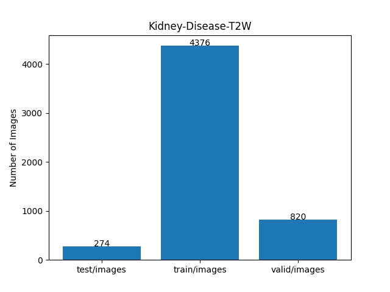 
 
As shown above, the number of images of train and valid datasets is large enough to use for a training set of our segmentation model.
  

<b>Train_images_sample</b> 
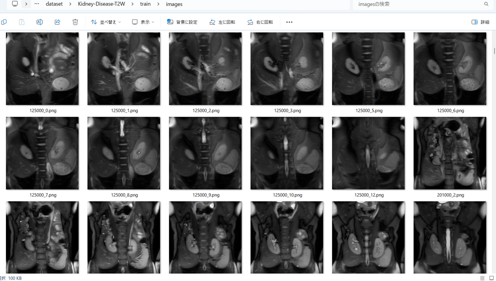
 
<b>Train_masks_sample</b> 
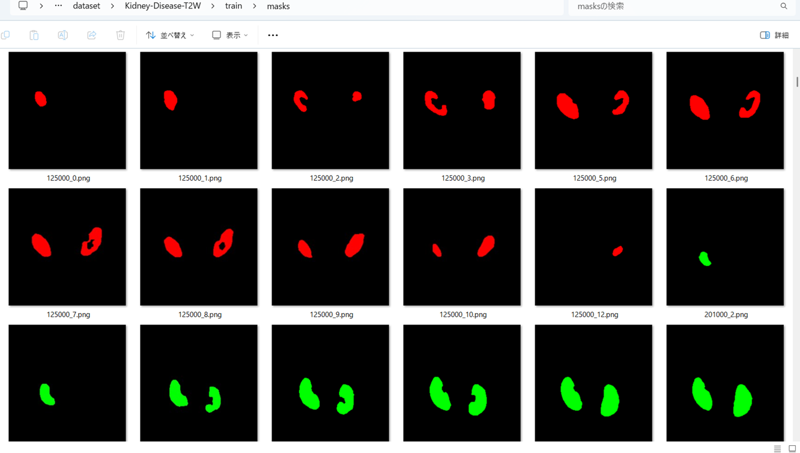
 
<h3>
3 Train TensorflowFlexUNet Model
</h3>
 We trained Kidney-Disease-T2W TensorflowFlexUNet Model by using the following
<a href="./projects/TensorFlowFlexUNet/Kidney-Disease-T2W/train_eval_infer.config"> <b>train_eval_infer.config</b></a> file.  
Please move to ./projects/TensorFlowFlexUNet/Kidney-Disease-T2W and run the following bat file. 
<pre>
>1.train.bat
</pre>
, which simply runs the following command. 
<pre>
>python ../../../src/TensorFlowFlexUNetTrainer.py ./train_eval_infer.config
</pre>

<b>Model parameters</b> 
Defined a small <b>base_filters=16</b> and a large <b>base_kernels=(11,11)</b> for the first Conv Layer of Encoder Block of 
<a href="./src/TensorFlowFlexUNet.py">TensorFlowFlexUNet.py</a> 
and a large num_layers (including a bridge between Encoder and Decoder Blocks).
<pre>
[model]
image_width    = 512
image_height   = 512
image_channels = 3
input_normalize = True
normalization  = False
num_classes    = 3
base_filters   = 16
base_kernels  = (11,11)
num_layers    = 8
dropout_rate   = 0.05
dilation       = (1,1)
</pre>

<b>Learning rate</b> 
Defined a small learning rate.  
<pre>
[model]
learning_rate  = 0.00007
</pre>

<b>Loss and metrics functions</b> 
Specified "categorical_crossentropy" and "dice_coef_multiclass". 
<pre>
[model]
loss           = "categorical_crossentropy"
metrics        = ["dice_coef_multiclass"]
</pre>
<b >Learning rate reducer callback</b> 
Enabled learing_rate_reducer callback, and a small reducer_patience.
<pre> 
[train]
learning_rate_reducer = True
reducer_factor     = 0.5
reducer_patience   = 4
</pre>
<b>Early stopping callback</b> 
Enabled early stopping callback with patience parameter.
<pre>
[train]
patience      = 10
</pre>
<b></b> 
<b>RGB color map</b> 
rgb color map dict for Kidney-Disease-T2W 1+2 classes. 
<pre>
[mask]
mask_file_format = ".png"
;Kidney-Disease-T2W 1+2
;   Cronic_Kidney_Disease: red,  Healthy_Control: green   
rgb_map = {(0,0,0):0, (255,0,0):1, (0,255,0):2, }       
</pre>
<b>Epoch change inference callbacks</b> 
Enabled epoch_change_infer callback. 
<pre>
[train]
epoch_change_infer       = True
epoch_change_infer_dir   =  "./epoch_change_infer"
epoch_changeinfer        = False
epoch_changeinfer_dir    = "./epoch_changeinfer"
num_infer_images         = 6
</pre>
By using this epoch_change_infer callback, on every epoch_change, the inference procedure can be called
 for 6 images in <b>mini_test</b> folder. This will help you confirm how the predicted mask changes 
 at each epoch during your training process.    
<b>Epoch_change_inference output at starting (1,2,3)</b> 
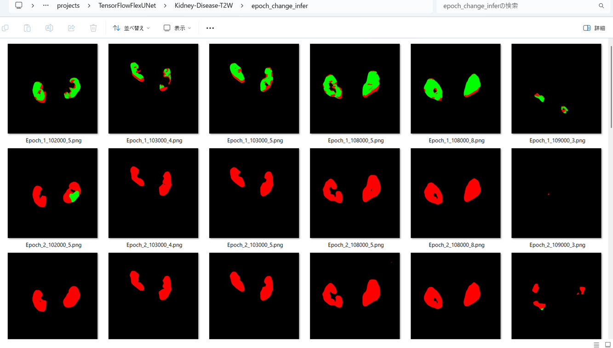 
 
<b>Epoch_change_inference output at middle-point (23,24,25)</b> 
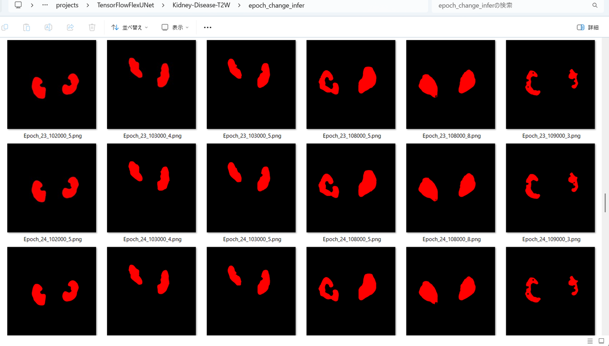 
 
<b>Epoch_change_inference output at ending (48,49,50)</b> 
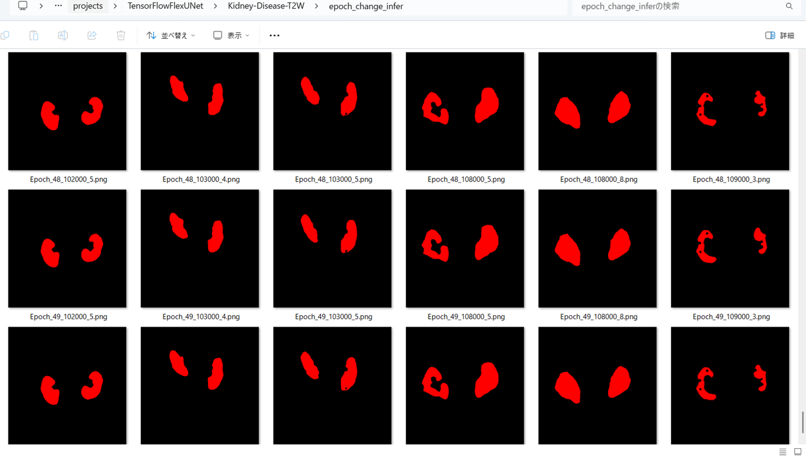 

 
In this experiment, the training process was terminated at epoch 50.  
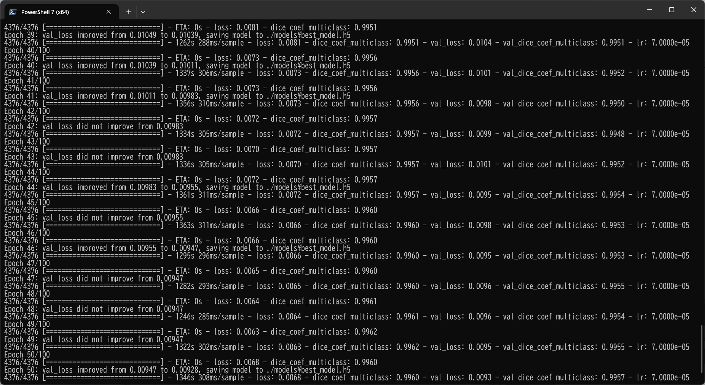 
 
<a href="./projects/TensorFlowFlexUNet/Kidney-Disease-T2W/eval/train_metrics.csv">train_metrics.csv</a> 
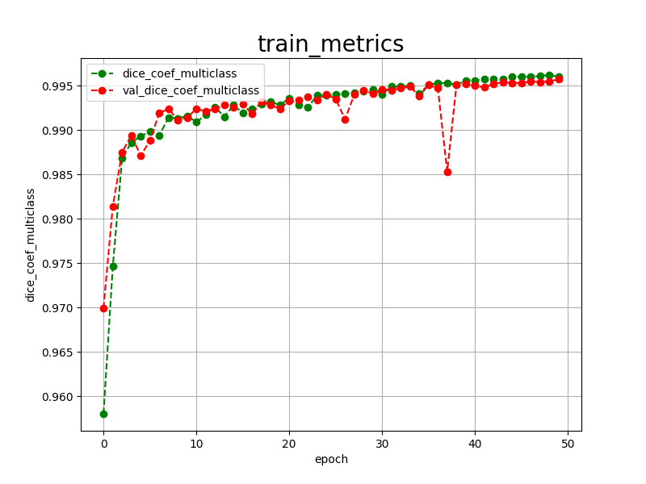 

 
<a href="./projects/TensorFlowFlexUNet/Kidney-Disease-T2W/eval/train_losses.csv">train_losses.csv</a> 
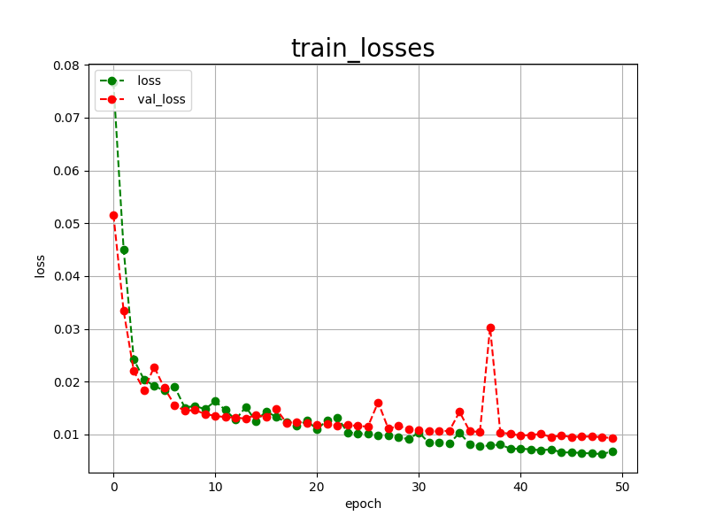 
 
<h3>
4 Evaluation
</h3>
Please move to a <b>./projects/TensorFlowFlexUNet/Kidney-Disease-T2W</b> folder, 
and run the following bat file to evaluate TensorflowFlexUNet model for Kidney-Disease-T2W. 
<pre>
>./2.evaluate.bat
</pre>
This bat file simply runs the following command.
<pre>
>python ../../../src/TensorFlowFlexUNetEvaluator.py  ./train_eval_infer.config
</pre>
Evaluation console output: 
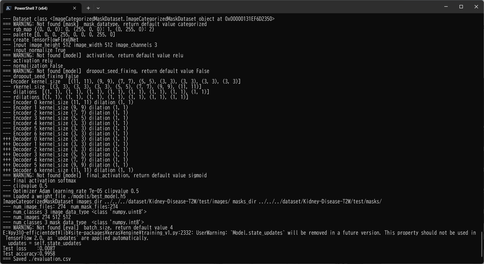
  Image-Segmentation-Kidney-Disease-T2W

<a href="./projects/TensorFlowFlexUNet/Kidney-Disease-T2W/evaluation.csv">evaluation.csv</a> 
The loss (categorical_crossentropy) to this Kidney-Disease-T2W/test was very low, and dice_coef_multiclass very high as shown below.
 
<pre>
categorical_crossentropy,0.0087
dice_coef_multiclass,0.9958
</pre>
 
<h3>5 Inference</h3>
Please move to a <b>./projects/TensorFlowFlexUNet/Kidney-Disease-T2W</b> folder 
,and run the following bat file to infer segmentation regions for images by the Trained-TensorflowFlexUNet model for Kidney-Disease-T2W. 
<pre>
>./3.infer.bat
</pre>
This simply runs the following command.
<pre>
>python ../../../src/TensorFlowFlexUNetInferencer.py ./train_eval_infer.config
</pre>

<b>mini_test_images</b> 
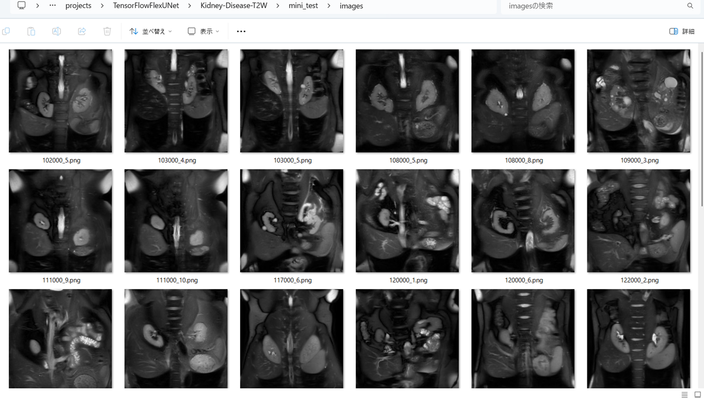 
<b>mini_test_mask(ground_truth)</b> 
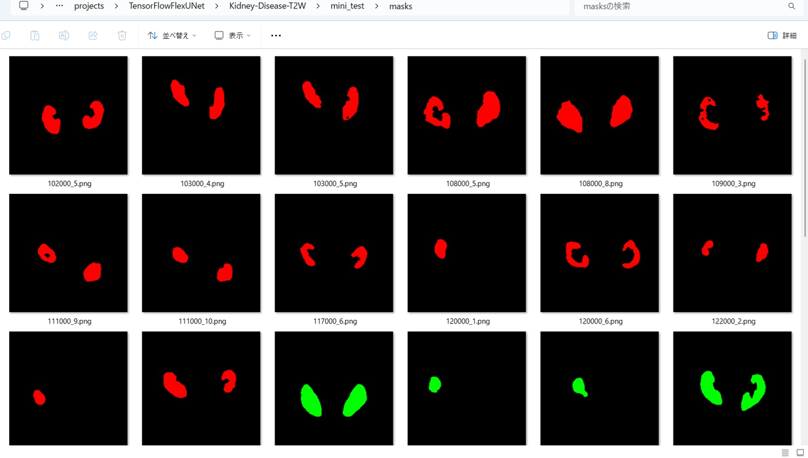 

<b>Inferred test masks</b> 
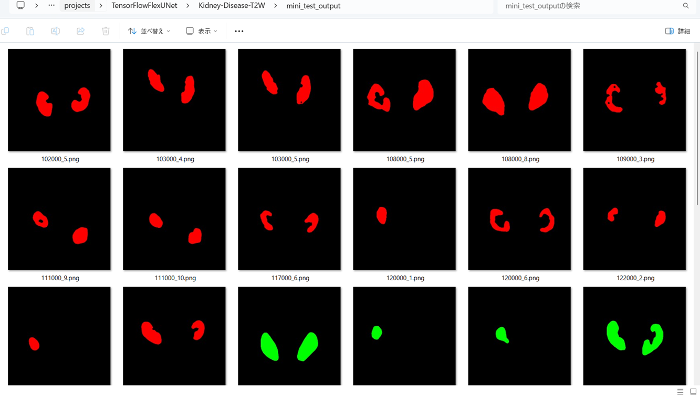 
 

<b>Enlarged images and masks for  Kidney-Disease-T2W  Images of 512x512 pixels</b> 
As shown below, the inferred masks predicted by our segmentation model trained by the dataset appear similar to the ground truth masks.
 
<b>rgb_map = {Cronic_Kidney_Disease: red,  Healthy_Control: green}</b>
 
 
<table>
<tr>
<th>Input: image</th>
<th>Mask (ground_truth)</th>
<th>Prediction: inferred_mask</th>
</tr>
<tr>
<td></td>
<td></td>
<td>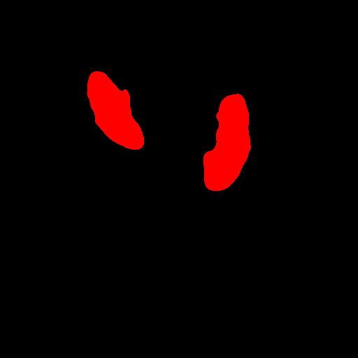</td>
</tr>

<tr>
<td>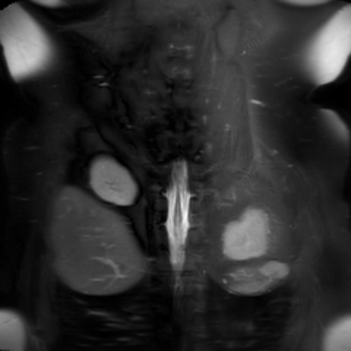</td>
<td>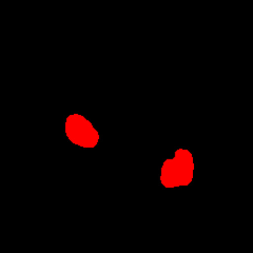</td>
<td></td>
</tr>

<tr>
<td>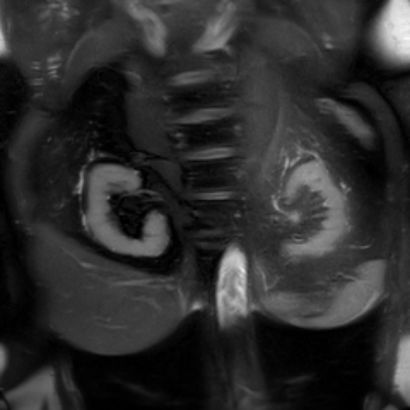</td>
<td>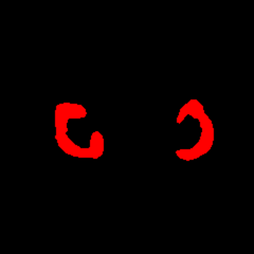</td>
<td>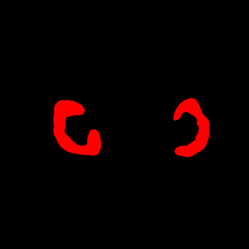</td>
</tr>
<tr>
<td>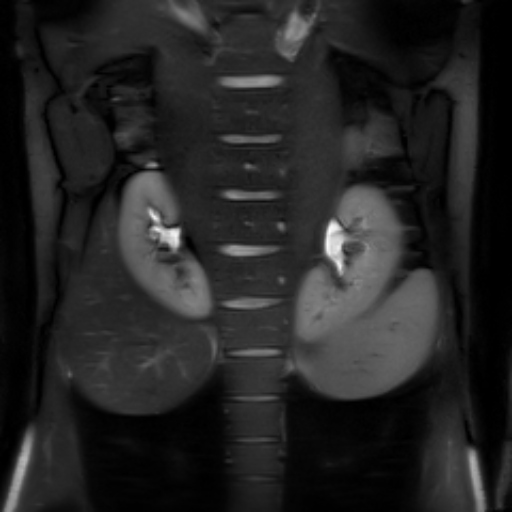</td>
<td></td>
<td></td>
</tr>
<tr>
<td>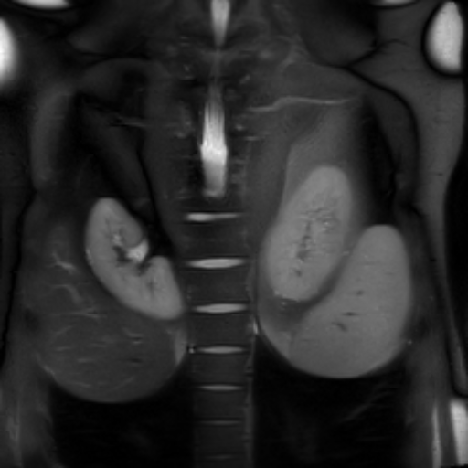</td>
<td></td>
<td></td>
</tr>
<tr>
<td>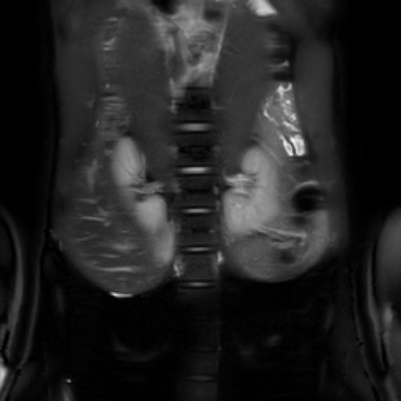</td>
<td>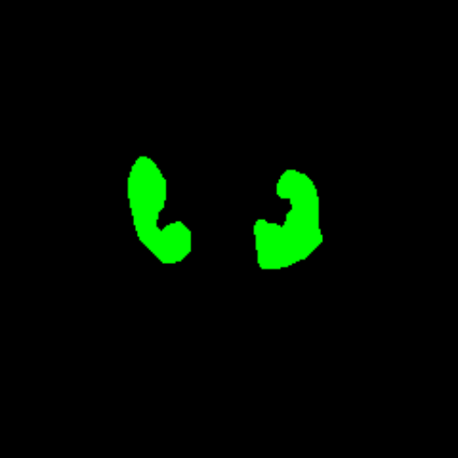</td>
<td>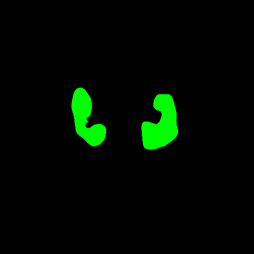</td>
</tr>
</table>

 
<h3>
References
</h3>

<b>1. Automated renal segmentation in healthy and chronic kidney disease subjects using a convolutional neural network</b> 
Alexander J. Daniel, Charlotte E. Buchanan, Thomas Allcock, Daniel Scerri, Eleanor F. Cox, 
 Benjamin L. Prestwich, Susan T. Francis 
<a href="https://onlinelibrary.wiley.com/doi/10.1002/mrm.28768">
https://onlinelibrary.wiley.com/doi/10.1002/mrm.28768
</a>
  

<b>2. TensorFlow-FlexUNet-Image-Segmentation-KiTS19-Kidney-Tumor</b> 
Toshiyuki Arai  
<a href="https://github.com/sarah-antillia/TensorFlow-FlexUNet-Image-Segmentation-KiTS19-Kidney-Tumor">
https://github.com/sarah-antillia/TensorFlow-FlexUNet-Image-Segmentation-KiTS19-Kidney-Tumor</a>
 
 

<b>3. TensorFlow-FlexUNet-Image-Segmentation-Model</b> 
Toshiyuki Arai  
<a href="https://github.com/sarah-antillia/TensorFlow-FlexUNet-Image-Segmentation-Model">
https://github.com/sarah-antillia/TensorFlow-FlexUNet-Image-Segmentation-Model
</a>
 
 
